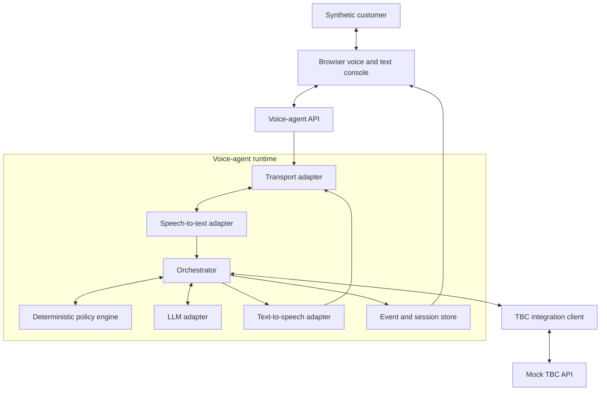

# Technical specification

## 1. Target architecture

The POC is a small local system with three deployable applications and several internal modules:

1. **Demo web console:** browser microphone/speaker, text fallback, call controls, transcript, and event timeline.
2. **Voice-agent API:** session API, media connection, orchestrator, policy engine, provider adapters, and audit events.
3. **Mock TBC API:** synthetic CRM, identity, offers, payment links, outcomes, transfers, and failure injection.



The policy engine is a module with a strict interface in the first POC. It may run in the same Python process as the orchestrator. It must not be folded into an LLM prompt. Keeping a service-like interface allows it to become a separate deployment later.

## 2. Recommended implementation stack

| Area | POC choice | Reason |
|---|---|---|
| Backend | Python 3.12, FastAPI, Pydantic | Matches the proposed FastAPI control layer and supports typed APIs/WebSockets |
| Orchestration | Pipecat where it reduces audio/turn work; otherwise a thin project-owned coordinator behind the same interfaces | Preserves the proposal direction without making the POC dependent on one framework |
| Web console | React, TypeScript, Vite | Quick browser audio and transparent event UI |
| Persistence | SQLite for sessions/outcomes; JSON/YAML fixtures for customers and policies | Easy reset and inspection |
| Tests | pytest, FastAPI test client, browser smoke test | Supports fast policy and contract testing |
| Packaging | `pyproject.toml`; one frontend package; Docker Compose optional | Local-first and agent-friendly |
| Observability | Structured JSON logs plus persisted domain events | Explainable demo without a monitoring stack |

Do not add Redis, Kafka, Kubernetes, or a production database to the first vertical slice. Introduce them only if an acceptance criterion cannot be met without them.

## 3. Runtime components

### 3.1 Session API

Responsibilities:

- Create, retrieve, and terminate demo sessions.
- Select the synthetic customer/campaign fixture.
- Issue the browser a session-scoped media connection.
- Expose the event stream and current state.
- Prevent cross-session access using unguessable IDs.

### 3.2 Transport adapter

Required implementations:

- `TextTransport`: accepts typed turns and returns text. Used by automated scenarios.
- `BrowserAudioTransport`: accepts browser microphone audio and returns generated audio over WebSocket or WebRTC.

Future implementation:

- `SipMediaTransport`: real TBC call audio. It is not part of the POC.

The orchestrator must consume transport-neutral events such as `user_turn_final` and emit `assistant_response`, rather than depending directly on browser messages.

### 3.3 STT adapter

Interface:

```python
class SpeechToText(Protocol):
    async def start_stream(self, session: SpeechSession) -> None: ...
    async def push_audio(self, chunk: AudioChunk) -> list[TranscriptEvent]: ...
    async def finish_stream(self) -> list[TranscriptEvent]: ...
```

Expected output includes partial/final text, language, confidence, and timing. Critical slots such as amount and date carry their own confidence when the provider supports it.

Implementations:

- `FakeSTT` for tests and no-credential local use.
- One real English-capable provider for the voice demo.
- Georgian provider adapter in a later milestone.

### 3.4 Orchestrator

The orchestrator owns session flow, not business authority. It:

- Converts transport events into turns.
- Tracks the current conversation state.
- Requests customer context and policy decisions.
- Calls the LLM with a constrained view of the session.
- Validates LLM output.
- Requests TTS for policy-approved text.
- Handles interruption, silence, retry limits, and timeouts.
- Calls mock TBC tools and records their results.
- Emits events for every transition and external call.

Only one user turn may be committed at a time. If audio yields overlapping final transcripts, serialize them by start time and discard duplicates.

### 3.5 Policy engine

Inputs:

- Current state.
- Verified identity status and evidence reference.
- Structured intent and slots.
- Bank context and eligible offers.
- Policy version and attempt counters.
- Health/availability of required integrations.

Outputs:

- `allowed`: whether the requested action can occur.
- `action`: approved next action.
- `next_state`.
- `reason_code`.
- `permitted_facts` and `permitted_offer_ids`.
- `required_confirmation`.
- Safe response template or escalation route when denied.

The policy engine must be pure and unit-testable wherever practical: the same input produces the same decision.

### 3.6 LLM adapter

The LLM receives only:

- The current state and allowed intents.
- A limited recent transcript.
- Facts explicitly permitted by the policy decision.
- Approved response guidance.
- A required JSON response schema.

It returns:

```json
{
  "intent": "promise_to_pay",
  "slots": {"amount": "275.40", "date": "2026-08-28"},
  "confidence": 0.94,
  "response_text": "To confirm, you plan to pay 275.40 GEL on 28 August. Is that correct?",
  "requested_action": "confirm_ptp"
}
```

The runtime rejects malformed output, unpermitted facts, unknown offer IDs, and requested actions not permitted by policy. On repeated failure it uses a deterministic safe template or escalates.

Required implementations:

- `FakeLLM` using fixture-driven intent/slot responses for tests.
- One enterprise LLM adapter for the interactive demo.

### 3.7 TTS adapter

Interface accepts policy-approved text plus language/voice configuration and returns audio chunks. Required implementations are `FakeTTS` for tests and one real provider for browser voice.

The TTS layer must not receive hidden customer context, raw policy data, or unapproved draft alternatives—only the final text to speak.

### 3.8 TBC integration client

Provides typed methods for identity, context, offers, outcome write-back, payment-link requests, and transfers. The POC client talks to `mock_tbc`; the production replacement would keep the same domain interface while changing authentication, endpoints, and schemas.

### 3.9 Event/session store

Persist:

- Session metadata and current state.
- Final transcripts and assistant text.
- Policy decisions and reason codes.
- Integration request/response summaries with sensitive fields redacted.
- State transitions, timing, errors, and final disposition.

Raw audio persistence is off by default. The operator may enable short-lived synthetic recordings for voice debugging, clearly indicated in the UI.

## 4. Provider selection and configuration

All providers are selected with environment variables:

```text
TRANSPORT_PROVIDER=text|browser
STT_PROVIDER=fake|<real-provider>
LLM_PROVIDER=fake|<enterprise-provider>
TTS_PROVIDER=fake|<real-provider>
VOICE_LANGUAGE=en-US
POLICY_VERSION=poc-v1
MOCK_TBC_BASE_URL=http://localhost:8090
```

Provider-specific keys use separate variables and must never appear in browser code or event payloads.

## 5. Performance targets

These are POC targets, not contractual service levels:

- Text-mode policy decision: under 100 ms locally at P95.
- First audible response after final user turn: under 2.5 seconds at P95 on a stable connection.
- Playback stop after detected interruption: under 750 ms at P95.
- Event timeline update: under 500 ms after server event creation.
- One local demo session is mandatory; five concurrent sessions are a stretch goal.

Record stage timings so latency can be attributed to STT, policy, LLM, TTS, or integration calls.

## 6. Local runtime

The finished POC should support:

```text
make dev         # starts web, voice-agent API, and mock TBC API
make test        # unit, contract, and text-scenario tests
make demo-reset  # resets SQLite and synthetic fixture state
```

Equivalent PowerShell scripts are acceptable. A clean checkout must be usable without paid credentials in text mode.

## 7. Production replacement map

| POC element | Later production replacement |
|---|---|
| Browser transport | TBC-approved SIP/RTP or media interface |
| Mock identity | TBC-approved identity method/API |
| JSON fixtures | TBC campaign and customer-context APIs |
| Mock offers | TBC policy/eligibility service |
| Mock SMS | TBC-authorized SMS/payment-link API |
| Mock transfer | TBC contact-centre queue/routing |
| SQLite events | Approved operational/audit stores and SIEM export |
| Development credentials | TBC SSO, workload identity, secrets manager, and network controls |
